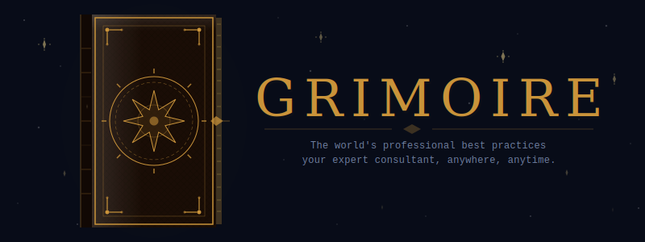
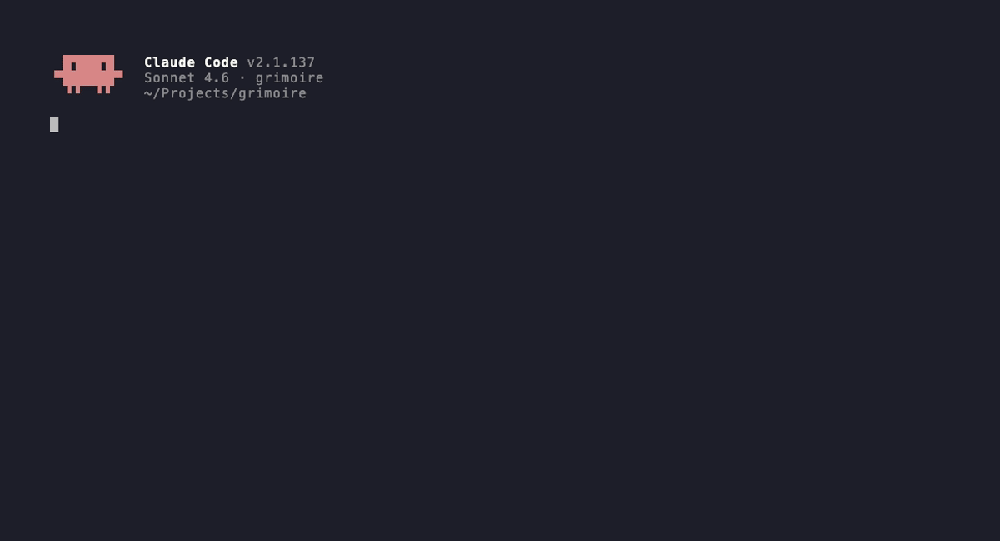

<div align="center">
  <a href="https://github.com/jeffreytse/grimoire">
    
  </a>

  <p>The world's knowledge is in your AI. The world's practice is not.<br>Most people don't know which best practice applies — and AI won't enforce one unless guided. Grimoire closes both gaps.</p>

  <br><h1>📖 Grimoire 📖</h1>

</div>

<h4 align="center">
  Promotes the expert standard you didn't know applied. Guides your <a href="#-agent-support">AI</a> through applying it — automatically, across every field.
</h4>

<p align="center">
  <a href="https://github.com/jeffreytse/grimoire/actions/workflows/validate.yml">
    
  </a>

  <a href="https://github.com/sponsors/jeffreytse">
    
  </a>

  <a href="https://github.com/jeffreytse/grimoire/releases">
    
  </a>

  <a href="https://github.com/jeffreytse/grimoire/graphs/contributors">
    
  </a>

  <a href="./LICENSE">
    
  </a>

  <a href="https://liberapay.com/jeffreytse">
    
  </a>

  <a href="https://patreon.com/jeffreytse">
    
  </a>

  <a href="https://ko-fi.com/jeffreytse">
    
  </a>

  <a href="#-agent-support">
    
  </a>

  <a href="./skills/">
    
  </a>
</p>

<div align="center">
  <h4>
    <a href="#-why-grimoire">Why</a> |
    <a href="#-skills-in-action">Features</a> |
    <a href="#%EF%B8%8F-install">Install</a> |
    <a href="#-quick-start">Quick Start</a> |
    <a href="#%EF%B8%8F-domains">Domains</a> |
    <a href="#-contributing">Contributing</a> |
    <a href="https://github.com/jeffreytse/grimoire/releases">Changelog</a> |
    <a href="#-license">License</a>
  </h4>
</div>

<div align="center">
  <sub>Built with ❤︎ by
  <a href="https://jeffreytse.net">jeffreytse</a> and
  <a href="https://github.com/jeffreytse/grimoire/graphs/contributors">contributors</a>
  </sub>
</div>
<br>

## 🎬 Demo

> "I'm 42, AI just took my job, I have a mortgage. What do I do?"



---

## 🤔 Why Grimoire?

Books gave everyone knowledge. Google gave everyone access. AI gave everyone comprehension. None of them gave everyone *practice*. Grimoire does.

---

Practice is what separates a senior attorney from a paralegal, a staff engineer from a junior, a seasoned surgeon from a resident. It is judgment earned through 10,000 hours of specific situations. It has always been locked behind expensive engagements, elite institutions, and years of hard experience. AI didn't unlock it — AI just made the gap more visible.

Ask an AI to review your architecture — it summarizes what it sees. Ask a staff engineer — she tells you the service boundary is wrong and exactly why. Ask an AI to review your contract — it says "this looks reasonable." Ask a senior M&A attorney — she finds the liability cap missing and the indemnification clause unenforceable in your jurisdiction. The model *knows* SOLID, DDD, Google SRE, and the ABA Model Rules. Without explicit guidance, it enforces none of them.

Grimoire is the enforcement layer. It introduces **skills** — one concept that makes expert knowledge composable, reusable, and enforceable across every field. A skill is not a prompt, not a plugin, not a template. It is a named, citable, executable unit of expert practice: one concept, one source, one set of steps, proven at scale.

---

- 🔍 **You don't know what you don't know.** When you face a problem, you search for a solution — not for the governing standard. The ISO certification process, the ABA clause audit, the NSCA periodization model — these exist. Most people solving those problems have never heard of them. Grimoire surfaces the expert standard you didn't know applied.

- 🤖 **Knowing is not enough. Grimoire enforces.** The model knows best practices across every field. Without structured guidance, it gives general advice. Grimoire provides specific steps, verifiable criteria, and repeatable results. Not summaries — verdicts.

- 🌍 **The world's best practices belong to everyone.** A McKinsey engagement costs $1M. A senior lawyer bills $800/hr. A structural engineer isn't available at 2am. The practices they follow — proven at the highest levels — are not proprietary. They belong to the world. Grimoire makes them free: not as descriptions, but as executable steps, cited and verified.

- 🧱 **Every profession. Every AI.** Not a tool for developers — a layer for everyone who works. 500+ skills across engineering, law, finance, health, writing, business, and 20+ more domains. Works with Claude, Codex, Cursor, Gemini, and OpenCode. Skills are plain Markdown — they outlive every AI assistant currently running.

---

A nurse who knows exactly how to triage. A jazz musician who knows how to teach improvisation. A securities lawyer who knows which clause kills a deal. If you've spent 10,000 hours mastering something, your practice belongs here. Every skill contributed makes grimoire more powerful for everyone who follows — this is how expert knowledge finally compounds.

→ [Read the full philosophy](./PHILOSOPHY.md)

---

## ✨ Skills in Action

**Engineering** — propose a commit message from staged diff:

```
User: /propose-conventional-commit

Claude: Inspecting staged changes...

  feat(auth): add OAuth2 PKCE flow for mobile clients

  Replaces implicit grant with PKCE to address RFC 6749 §10.16
  implicit flow vulnerabilities in native apps.

  Approve? [y/n]
```

**Law** — audit a SaaS contract before signing:

```
User: /review-saas-contract

Claude: Red flags found.

  🔴 CRITICAL  Liability cap is $500 — your contract value is $240,000
  🔴 CRITICAL  No data processing agreement — GDPR Art.28 requires one
               before processing any EU customer data
  🟡 WARNING   Auto-renewal clause: 90-day cancellation window in §14.3
  🟡 WARNING   IP ownership of custom integrations is unassigned
  ✓  PASS      SLA 99.9% with defined service credits

  Do not sign. Renegotiate: liability cap, DPA, IP clause.
  Source: ABA model SaaS agreements
```

**Finance** — calculate how much you need to retire:

```
User: /calculate-fire-number

Claude: Applying Trinity Study model (Bengen 1994, 95% 30-year success rate)

  Annual expenses:       $60,000
  Safe withdrawal rate:  4.0%
  ─────────────────────────────
  FIRE number:           $1,500,000

  At $4,000/month invested + 7% real return → retire in 20.4 years
  Cut annual spend by $12,000               → retire in 16.8 years

  Next: /design-portfolio-allocation
```

**Health** — design a training program:

```
User: /design-training-program

Claude: Hypertrophy block — intermediate, 4 days/week

  UPPER (Mon/Thu)   Bench 4×8 · Row 4×8 · OHP 3×10 · Face pull 3×15
  LOWER (Tue/Fri)   Squat 4×6 · RDL 3×8 · Leg press 3×12

  Progressive overload: +2.5 kg when all reps completed clean
  Week 5: deload — 40% volume, same intensity

  Source: NSCA CSCS + Israetel volume landmarks (2019)
```

Every skill is structured: triggering condition, verified source, numbered steps, no freeform guessing.

**Or describe the situation in plain language** — you don't need to know which skill applies:

```
User: I signed a vendor contract and now they're saying they own my data.

Claude: Situation matches: review-saas-contract (law/contracts)
        Applying review-best-practice-fit...

        🔴 CRITICAL Data ownership clause absent — defaults to vendor jurisdiction
        → Escalate to legal counsel immediately. Request amendment to §8.2.
```

```
User: My team keeps missing sprint goals and I don't know why.

Claude: Situation matches: plan-retrospective (engineering/project-management)

        Run a blameless retrospective (Amazon format):
        1. Timeline reconstruction — what actually happened
        2. Five whys — surface root causes, not symptoms
        3. Action items with owners and deadlines
        → /plan-retrospective to run the session now
```

`suggest-best-practice` auto-classifies any situation, routes to the matching skill,
or tells you exactly what to install if the skill isn't in your library yet.

---

## ⚒️ Install

**One command. Every AI agent on your system.**

```bash
curl -fsSL https://raw.githubusercontent.com/jeffreytse/grimoire/main/scripts/grimoire | bash
```

Auto-detects Claude Code, Codex, and Gemini CLI. Installs to every agent found. Also creates a global `grimoire` command for future installs and upgrades.

---

**Windows (PowerShell):**

```powershell
Invoke-WebRequest https://raw.githubusercontent.com/jeffreytse/grimoire/main/scripts/grimoire.ps1 -OutFile grimoire.ps1; .\grimoire.ps1
```

---

**Native plugin shortcuts (Claude Code):**

```bash
# Step 1: add the marketplace
/plugin marketplace add jeffreytse/grimoire

# Step 2: install (skills are namespaced, e.g. /grimoire-engineering:propose-conventional-commit)
/plugin install grimoire@grimoire                   # all domains (latest)
/plugin install grimoire-engineering@grimoire       # one domain

# For subdomain-level installs, use grimoire
```

---

**Granular script installs:**

```bash
./scripts/grimoire                   # interactive TUI — install/uninstall/upgrade/doctor
./scripts/grimoire --domain engineering
./scripts/grimoire --domain engineering --subdomain development
./scripts/grimoire --skill engineering/development/propose-conventional-commit
./scripts/grimoire --target all      # force install to all agents, even if not detected
./scripts/grimoire --upgrade         # pull latest (choose stable or unstable channel)
./scripts/grimoire --doctor          # health check: git repo, symlinks, config
./scripts/grimoire --version         # version info with commit and date
./scripts/grimoire --list            # list available domains and skills
```

**Gemini CLI:**

```bash
gemini extensions install https://github.com/jeffreytse/grimoire          # latest
gemini extensions install https://github.com/jeffreytse/grimoire@v1.0.0   # pin to a release
gemini extensions update grimoire                                         # update later
```

---

**Cursor:**

```bash
./scripts/grimoire --target cursor
```

---

**OpenCode:** add to `opencode.json`:
```json
{ "plugin": ["grimoire@git+https://github.com/jeffreytse/grimoire.git"] }
```

---

## 🚀 Quick Start

**After install, describe any problem in plain language:**

```
User: I need to raise a Series A but don't know how to pitch investors.

Claude: Situation matches: write-value-proposition + design-go-to-market + apply-pyramid-principle
        Applying suggest-best-practice...
        → Start with your value prop. /write-value-proposition
```

Or invoke a skill directly:

```bash
/suggest-best-practice     # describe any problem — auto-routes to the right skill
/review-pull-request       # engineering code review
/calculate-fire-number     # how much do I need to retire?
/review-saas-contract      # flag dangerous clauses before signing
/design-training-program   # build a training program
```

**New to grimoire?** Start with `/suggest-best-practice`. Describe any professional or life situation — it reads your context and routes you to the matching skill, or tells you exactly what to install if the skill isn't in your library yet.

---

## 🎯 Workflows

| Your situation | Start here |
|----------------|------------|
| Know exactly which skill you need | `/skill-name` directly |
| Have a problem, unsure which skill | `/suggest-best-practice` |
| Already have a plan, want gaps checked | `/review-best-practice-fit` |
| Problem spans 3+ independent domains | `/plan-best-practice-solution` |
| Complex problem within one domain | `/apply-best-practice-tree` |
| Don't know what practices exist for a topic | `/discover-best-practices` |
| About to start a task — want to catch gaps before you begin | `/intercept-best-practice` |
| Problem isn't clear yet — need to define it before solving | `/analyze-problem` |
| Activate a paradigm's best practices (OOP, TDD, etc.) | `/apply-best-practice-profile` |
| Align any project or artifact to stated best practice preferences (BPDD) | `/apply-best-practice-driven-development` |
| Check if any artifact aligns with stated best practice preferences | `/check-best-practice-compliance` |
| Have a specific compliance finding to fix | `/fix-best-practice-finding` |
| Two practices conflict (e.g., Google vs IBM) | `/pin-best-practice-preference` |

→ [BPDD guide](./docs/bpdd.md) — cycle, compliance linter, LSP output, suppression, CI integration

### Common paths

**Describe any problem → `suggest-best-practice`**

Describe any situation. `suggest-best-practice` reads it, finds the best-matching skill(s), and routes you there.

```
User: My senior engineer just quit and the team is losing confidence.

Claude: Situation matches: design-onboarding-program + write-leadership-principles
        → /design-onboarding-program to rebuild team structure
        → /write-leadership-principles to establish decision-making clarity
```

**Problem spans multiple domains → `plan-best-practice-solution`**

When a problem involves 3+ independent fields, `plan-best-practice-solution` decomposes it with MECE methodology and sequences skills by dependency.

```
User: I want to leave my job and launch a SaaS startup.

Claude: Situation spans 4 domains. Solution plan:
        1. design-business-model    — validate the idea before building
        2. calculate-unit-economics — confirm revenue model is viable
        3. review-saas-contract     — legal structure before hiring
        4. design-go-to-market      — growth strategy before launch

        Apply in order? I'll pause for confirmation after each step.
```

### Contributor workflows

**Adding a skill**

```
/write-best-practice-skill    # author the skill
/review-best-practice-skill   # validate against STANDARD.md (5 criteria)
/revise-best-practice-skill   # fix any review findings
→ open PR
```

**Maintaining a domain**

```
/audit-best-practice-domain    # batch health check — surfaces outdated or weak-sourced skills
/revise-best-practice-skill    # update stale or under-sourced skills
/deprecate-best-practice-skill # retire skills superseded by newer practices
```

---

## ⚙️ Settings

When top-tier orgs disagree (Google vs IBM, startup vs enterprise), pin which approach you prefer once — grimoire applies it automatically from then on.

```
User: I follow Google's engineering practices when there's a conflict.

Claude: Pinning preference: Google Engineering Practices → engineering domain.
        Save to: session / project / global?

User: global

Claude: Saved to ~/.config/grimoire/settings.toml.
        Future engineering conflicts resolve toward Google's approach automatically.
```

**Override priority** — grimoire checks preferences in this order, first match wins:

| Priority | Level | Stored in | Scope |
|----------|-------|-----------|-------|
| 1st | Session | In-memory | Current session only — resets when session ends |
| 2nd | Project personal | `.grimoire/settings.local.toml` | Current project, gitignored |
| 3rd | Project shared | `.grimoire/settings.toml` | Current project, committed to repo |
| 4th | Global | `~/.config/grimoire/settings.toml` | All projects on this machine |

**Configure manually** — edit the settings files directly without going through the AI:

```toml
# ~/.config/grimoire/settings.toml  (global — applies everywhere)
profiles = ["oop"]                 # activate all skills tagged "oop"
# profiles = ["clean-architecture", "tdd"]  # multiple — first entry wins conflicts

[engineering]
practices = ["Google Engineering Practices"]

[finance]
practices = ["CFA Institute standards"]
```

```toml
# <project-root>/.grimoire/settings.toml  (project — overrides global for this repo)
[engineering.architecture]
practices = [
  "SOLID principles: production code",
  "KISS: prototypes, scripts"
]
fallback = "ask"
```

Project settings override global. Session pins override both. Teams can share a global standard while individual projects deviate where needed.

**`practices = ["OOP"]` vs `profiles = ["oop"]`** — both signal OOP intent, but differently. `practices = ["OOP"]` in a domain section is a loose hint — the AI leans toward OOP conventions from its training. `profiles = ["oop"]` at the top level activates specific installed skills (exact steps, validated sources). Use `profiles` for precision; `practices` for domain-level style preference. → [Full comparison](./docs/profiles.md#profiles-vs-practices)

**Guided settings management:** Use `/configure-grimoire` to view, edit, or validate settings without touching TOML directly. Use `/apply-best-practice-profile` to activate a full paradigm (OOP, TDD, clean architecture) in one command. Use `/resolve-best-practice-conflict` to resolve contradictions between two installed skills and record the priority automatically. Use `/apply-best-practice-driven-development` to run the full BPDD cycle — or see the [BPDD guide](./docs/bpdd.md) for the linter, LSP output, and CI integration details.

---

## 🎭 Profiles

Activate a named set of skills in one line — no list to maintain, no file to create.

```toml
# .grimoire/settings.toml
profiles = ["oop"]   # activates every installed skill tagged "oop"
```

Grimoire resolves the name in this order, first match wins:

1. `.grimoire/profiles/<name>.toml` — project-level file
2. `~/.grimoire/profiles/<name>.toml` — user-level file
3. `.grimoire/profiles/default.toml` — project-level fallback
4. `~/.grimoire/profiles/default.toml` — user-level fallback
5. Tag query — all installed skills where `tags` contains the name

If no file exists, the tag query fires automatically. `profiles = ["oop"]` works without creating any file.

**Multiple profiles** — combine paradigms; first entry wins conflicts, duplicates are deduplicated:

```toml
profiles = ["clean-architecture", "tdd"]  # clean-architecture wins if both include the same skill
```

**Custom profile** — curate a team-specific subset when the tag set is too broad:

```toml
# .grimoire/profiles/my-team.toml
name = "my-team"
description = "Our backend team's default practices"

[[skills]]
name = "apply-solid-principles"

[[skills]]
name = "apply-domain-driven-design"
```

Commit `.grimoire/profiles/` to share standards across the team. Publish as a gist or repo (`grimoire-profile-<name>`) for the community.

**`profiles` vs `practices`** — `profiles` activates skill bundles globally; `practices` is a domain-scoped explicit list. → [Full comparison](./docs/profiles.md#profiles-vs-practices)

→ [Full profiles guide](./docs/profiles.md) — resolution order, conflict handling, sharing profiles

---

## 📏 BPDD — Best Practice Driven Development

Grimoire doubles as a best-practice linter. Encode your quality criteria once in `settings.toml`, then run `/check-best-practice-compliance` against any artifact — a codebase, a legal contract, a business plan, a training program. Same criteria every run. Gaps that survive human review get caught by the check.

**The cycle** — same inversion as TDD: declare what "good" looks like first, then bring the artifact into alignment.

```
1. Red      — run compliance check; identify which practices FAIL or are PARTIAL
2. Green    — invoke the relevant grimoire skill; fix until the check passes
3. Refactor — clean up while keeping the check green
4. Commit   — record progress; repeat for next gap
```

Run `/apply-best-practice-driven-development` to drive the full cycle. Run `/check-best-practice-compliance` for a one-off check.

**Output** — dual format, always written to `.grimoire/reports/`:

| File | Format | Use |
|------|--------|-----|
| `compliance-<timestamp>.json` | LSP-compatible JSON | editors, CI pipelines, LSP servers, dashboards |
| `compliance-<timestamp>.html` | HTML | browser or CI artifact upload |

The JSON follows the LSP Diagnostic schema — `uri` + `range` locate any finding in any text artifact, not just code. Gate CI by checking `"threshold.status"` in the output:

```bash
result=$(jq -r '.threshold.status' .grimoire/reports/compliance-latest.json)
[ "$result" = "pass" ] || exit 1
```

**Coverage thresholds** — set in `settings.toml`, enforced on every check:

```toml
[engineering]
compliance-threshold = 80        # fail if overall criteria coverage < 80%
compliance-threshold-error = 0   # fail if any error-severity violations remain
```

Use `/fix-best-practice-finding` to fix one specific compliance finding — targeted, location-aware, verified. Use `/apply-best-practice-driven-development` to fix everything systematically.

→ [Full BPDD guide](./docs/bpdd.md) — cycle, linter, LSP schema, false positive suppression, incremental mode

---

## 🌟 Featured Skills

| Skill | Domain | Source methodology | Verified |
|-------|--------|--------------------|----------|
| [`apply-five-whys`](./skills/engineering/reliability/skills/apply-five-whys/) | engineering/reliability | Toyota Production System / Google SRE | ✓ |
| [`design-go-to-market`](./skills/business/strategy/skills/design-go-to-market/) | business/strategy | Moore "Crossing the Chasm" | ✓ |
| [`audit-gdpr-compliance`](./skills/law/privacy/skills/audit-gdpr-compliance/) | law/privacy | GDPR / EDPB guidelines | ✓ |
| [`calculate-fire-number`](./skills/finance/personal-finance/skills/calculate-fire-number/) | finance/personal-finance | Bengen (1994) / Trinity Study | ✓ |
| [`design-training-program`](./skills/health/fitness/skills/design-training-program/) | health/fitness | NSCA CSCS curriculum | ✓ |
| [`apply-mise-en-place`](./skills/cooking/techniques/skills/apply-mise-en-place/) | cooking/techniques | Culinary Institute of America | ✓ |
| [`apply-acceptance-commitment-therapy`](./skills/psychology/cognitive/skills/apply-acceptance-commitment-therapy/) | psychology/cognitive | Hayes / ACBS meta-analyses | ✓ |
| [`apply-spaced-repetition`](./skills/education/curriculum/skills/apply-spaced-repetition/) | education/curriculum | Ebbinghaus / Roediger & Karpicke | ✓ |
| [`write-value-proposition`](./skills/writing/copywriting/skills/write-value-proposition/) | writing/copywriting | Osterwalder "Value Proposition Design" | ✓ |
| [`design-training-periodization-plan`](./skills/sports/training/skills/design-training-periodization-plan/) | sports/training | Bompa "Periodization" / NSCA | ✓ |

→ [Browse all 500+ skills by domain](./SKILLS.md)

---

## 📐 The Grimoire Skill Standard

grimoire maintains an open standard for AI agent skill quality — freely adoptable by any skill library.

Every skill must pass `review-best-practice-skill` before merge:

| Criterion | Requirement | Rejection example |
|-----------|-------------|-------------------|
| **Adopted by** | Named organizations or institutions | "Many top companies" |
| **Impact** | Cited study or % number | "Significantly improves quality" |
| **Steps** | Immediately executable | Abstract theory or advice |
| **Scope** | One concept per skill | "Nutrition and training program" |
| **Source** | External institution or standard body | `grimoire STANDARD.md` |

→ [Read the full standard](./STANDARD.md) · [Adopt this standard](./STANDARD.md#adopting-this-standard)

See [CONTRIBUTING.md](./CONTRIBUTING.md) to submit a skill.

---

## 🗺️ Domains

grimoire is a framework + reference skills. The domain structure is ready — contribute to fill your domain.

| Domain | Sub-domains |
| ------ | ----------- |
| [grimoire](./skills/meta/) | **Setup:** [install-grimoire](./skills/meta/skills/install-grimoire/) · [configure-grimoire](./skills/meta/skills/configure-grimoire/) · **Problem analysis:** [analyze-problem](./skills/meta/skills/analyze-problem/) · [discover-best-practices](./skills/meta/skills/discover-best-practices/) · **Routing:** [suggest-best-practice](./skills/meta/skills/suggest-best-practice/) · [intercept-best-practice](./skills/meta/skills/intercept-best-practice/) · **Solution planning:** [plan-best-practice-solution](./skills/meta/skills/plan-best-practice-solution/) · [apply-best-practice-tree](./skills/meta/skills/apply-best-practice-tree/) · **Practice evaluation:** [review-best-practice-fit](./skills/meta/skills/review-best-practice-fit/) · [compare-best-practices](./skills/meta/skills/compare-best-practices/) · [audit-applied-best-practices](./skills/meta/skills/audit-applied-best-practices/) · **Practice understanding:** [explain-best-practice](./skills/meta/skills/explain-best-practice/) · [adapt-best-practice](./skills/meta/skills/adapt-best-practice/) · [teach-best-practice](./skills/meta/skills/teach-best-practice/) · **Preferences:** [pin-best-practice-preference](./skills/meta/skills/pin-best-practice-preference/) · [resolve-best-practice-conflict](./skills/meta/skills/resolve-best-practice-conflict/) · [apply-best-practice-profile](./skills/meta/skills/apply-best-practice-profile/) · [write-best-practice-profile](./skills/meta/skills/write-best-practice-profile/) · [review-best-practice-profile](./skills/meta/skills/review-best-practice-profile/) · [share-best-practice-profile](./skills/meta/skills/share-best-practice-profile/) · **Compliance:** [apply-best-practice-driven-development](./skills/meta/skills/apply-best-practice-driven-development/) · [check-best-practice-compliance](./skills/meta/skills/check-best-practice-compliance/) · **Contributors:** [write-best-practice-skill](./skills/meta/skills/write-best-practice-skill/) · [review-best-practice-skill](./skills/meta/skills/review-best-practice-skill/) · [revise-best-practice-skill](./skills/meta/skills/revise-best-practice-skill/) · [audit-best-practice-domain](./skills/meta/skills/audit-best-practice-domain/) · [deprecate-best-practice-skill](./skills/meta/skills/deprecate-best-practice-skill/) · [design-best-practice-domain](./skills/meta/skills/design-best-practice-domain/) |
| [engineering](./skills/engineering/) | [development](./skills/engineering/development/skills/), [frontend](./skills/engineering/frontend/skills/), [architecture](./skills/engineering/architecture/skills/), [testing](./skills/engineering/testing/skills/), [reliability](./skills/engineering/reliability/skills/), [devops](./skills/engineering/devops/skills/), [cloud](./skills/engineering/cloud/skills/), [networking](./skills/engineering/networking/skills/), [security](./skills/engineering/security/skills/), [data](./skills/engineering/data/skills/), [ai](./skills/engineering/ai/skills/), [hardware](./skills/engineering/hardware/skills/), [mobile](./skills/engineering/mobile/skills/), [performance](./skills/engineering/performance/skills/), [project-management](./skills/engineering/project-management/skills/), [product](./skills/engineering/product/skills/), [documentation](./skills/engineering/documentation/skills/) |
| [writing](./skills/writing/) | [creative](./skills/writing/creative/skills/), [technical](./skills/writing/technical/skills/), [copywriting](./skills/writing/copywriting/skills/), [academic](./skills/writing/academic/skills/), [journalism](./skills/writing/journalism/skills/) |
| [design](./skills/design/) | [ui-ux](./skills/design/ui-ux/skills/), [graphic](./skills/design/graphic/skills/), [branding](./skills/design/branding/skills/), [motion](./skills/design/motion/skills/), [product](./skills/design/product/skills/) |
| [business](./skills/business/) | [strategy](./skills/business/strategy/skills/), [operations](./skills/business/operations/skills/), [leadership](./skills/business/leadership/skills/), [entrepreneurship](./skills/business/entrepreneurship/skills/), [hr](./skills/business/hr/skills/) |
| [science](./skills/science/) | [biology](./skills/science/biology/skills/), [physics](./skills/science/physics/skills/), [chemistry](./skills/science/chemistry/skills/), [mathematics](./skills/science/mathematics/skills/), [earth-science](./skills/science/earth-science/skills/), [astronomy](./skills/science/astronomy/skills/) |
| [marketing](./skills/marketing/) | [seo](./skills/marketing/seo/skills/), [content](./skills/marketing/content/skills/), [social-media](./skills/marketing/social-media/skills/), [paid-ads](./skills/marketing/paid-ads/skills/), [growth](./skills/marketing/growth/skills/), [analytics](./skills/marketing/analytics/skills/) |
| [health](./skills/health/) | [fitness](./skills/health/fitness/skills/), [nutrition](./skills/health/nutrition/skills/), [mental-health](./skills/health/mental-health/skills/), [sleep](./skills/health/sleep/skills/), [medicine](./skills/health/medicine/skills/) |
| [finance](./skills/finance/) | [personal-finance](./skills/finance/personal-finance/skills/), [investing](./skills/finance/investing/skills/), [accounting](./skills/finance/accounting/skills/), [real-estate](./skills/finance/real-estate/skills/), [corporate](./skills/finance/corporate/skills/) |
| [education](./skills/education/) | [curriculum](./skills/education/curriculum/skills/), [teaching](./skills/education/teaching/skills/), [e-learning](./skills/education/e-learning/skills/), [assessment](./skills/education/assessment/skills/), [learning-science](./skills/education/learning-science/skills/) |
| [film](./skills/film/) | [cinematography](./skills/film/cinematography/skills/), [directing](./skills/film/directing/skills/), [editing](./skills/film/editing/skills/), [screenwriting](./skills/film/screenwriting/skills/), [production](./skills/film/production/skills/) |
| [law](./skills/law/) | [contracts](./skills/law/contracts/skills/), [ip](./skills/law/ip/skills/), [employment](./skills/law/employment/skills/), [privacy](./skills/law/privacy/skills/), [corporate](./skills/law/corporate/skills/) |
| [photography](./skills/photography/) | [composition](./skills/photography/composition/skills/), [lighting](./skills/photography/lighting/skills/), [editing](./skills/photography/editing/skills/), [genres](./skills/photography/genres/skills/) |
| [music](./skills/music/) | [composition](./skills/music/composition/skills/), [production](./skills/music/production/skills/), [mixing](./skills/music/mixing/skills/), [theory](./skills/music/theory/skills/), [performance](./skills/music/performance/skills/) |
| [cooking](./skills/cooking/) | [techniques](./skills/cooking/techniques/skills/), [baking](./skills/cooking/baking/skills/), [flavor](./skills/cooking/flavor/skills/), [nutrition](./skills/cooking/nutrition/skills/), [world-cuisine](./skills/cooking/world-cuisine/skills/) |
| [language](./skills/language/) | [learning](./skills/language/learning/skills/), [linguistics](./skills/language/linguistics/skills/), [translation](./skills/language/translation/skills/), [communication](./skills/language/communication/skills/) |
| [art](./skills/art/) | [drawing](./skills/art/drawing/skills/), [painting](./skills/art/painting/skills/), [digital-art](./skills/art/digital-art/skills/), [illustration](./skills/art/illustration/skills/), [color-theory](./skills/art/color-theory/skills/) |
| [sports](./skills/sports/) | [training](./skills/sports/training/skills/), [coaching](./skills/sports/coaching/skills/), [nutrition](./skills/sports/nutrition/skills/), [tactics](./skills/sports/tactics/skills/), [recovery](./skills/sports/recovery/skills/) |
| [productivity](./skills/productivity/) | [time-management](./skills/productivity/time-management/skills/), [habits](./skills/productivity/habits/skills/), [focus](./skills/productivity/focus/skills/), [goals](./skills/productivity/goals/skills/), [tools](./skills/productivity/tools/skills/) |
| [travel](./skills/travel/) | [planning](./skills/travel/planning/skills/), [budgeting](./skills/travel/budgeting/skills/), [cultural](./skills/travel/cultural/skills/), [adventure](./skills/travel/adventure/skills/) |
| [psychology](./skills/psychology/) | [cognitive](./skills/psychology/cognitive/skills/), [behavioral](./skills/psychology/behavioral/skills/), [social](./skills/psychology/social/skills/), [clinical](./skills/psychology/clinical/skills/), [positive](./skills/psychology/positive/skills/) |
| [home](./skills/home/) | [renovation](./skills/home/renovation/skills/), [interior-design](./skills/home/interior-design/skills/), [gardening](./skills/home/gardening/skills/), [organization](./skills/home/organization/skills/), [smart-home](./skills/home/smart-home/skills/) |
| [environment](./skills/environment/) | [sustainability](./skills/environment/sustainability/skills/), [ecology](./skills/environment/ecology/skills/), [climate](./skills/environment/climate/skills/), [energy](./skills/environment/energy/skills/), [policy](./skills/environment/policy/skills/) |
| [pets](./skills/pets/) | [dogs](./skills/pets/dogs/skills/), [cats](./skills/pets/cats/skills/), [training](./skills/pets/training/skills/), [nutrition](./skills/pets/nutrition/skills/), [health](./skills/pets/health/skills/) |
| [fashion](./skills/fashion/) | [styling](./skills/fashion/styling/skills/), [wardrobe](./skills/fashion/wardrobe/skills/), [design](./skills/fashion/design/skills/), [sustainability](./skills/fashion/sustainability/skills/), [accessories](./skills/fashion/accessories/skills/) |
| [parenting](./skills/parenting/) | [infant](./skills/parenting/infant/skills/), [toddler](./skills/parenting/toddler/skills/), [school-age](./skills/parenting/school-age/skills/), [teen](./skills/parenting/teen/skills/) |
| [automotive](./skills/automotive/) | [maintenance](./skills/automotive/maintenance/skills/), [troubleshooting](./skills/automotive/troubleshooting/skills/), [buying](./skills/automotive/buying/skills/), [modifications](./skills/automotive/modifications/skills/), [ev](./skills/automotive/ev/skills/) |

---

## 🤖 Agent Support

| Agent | Plugin install | Script install |
| ----- | -------------- | -------------- |
| Claude Code | `/plugin marketplace add jeffreytse/grimoire` then `/plugin install grimoire@grimoire` | `--target claude` |
| GitHub Copilot CLI | `copilot plugin marketplace add jeffreytse/grimoire` then `copilot plugin install grimoire@grimoire` | `--target all` |
| Gemini CLI | `gemini extensions install https://github.com/jeffreytse/grimoire` | `--target gemini` |
| OpenCode | See [`.opencode/INSTALL.md`](./.opencode/INSTALL.md) | `--target all` |
| Codex CLI | `AGENTS.md` auto-loaded; browse `/plugins` in CLI | `--target codex` |
| Cursor | `AGENTS.md` context injection | `--target cursor` |

---

## ❓ FAQ

**Isn't this already in the model's training data?**

Yes — and no. Models know *about* best practices. Skills make models *do* them, reliably.

The difference:

| Without a skill | With a skill |
|-----------------|--------------|
| Model improvises a version of the practice | Model follows the exact steps from the source institution |
| Output varies every run | Same process, same structure, every time |
| Practice applied only if you know to ask | Skill triggers automatically when the situation matches |
| Generic advice | Specific: the right gate, the right question, the right output format |

For simple tasks (write a test, fix a bug), the skeptic is right — the model doesn't need a skill. For complex, multi-step workflows — an SLO design, a post-mortem, an incident response — skills measurably change what you get. The model knows Google's engineering review process exists. It does not reliably know which question to ask first, what the output format is, or when to stop. That's what a skill encodes.

**These are just textbook practices the model already knows. Why bother?**

Knowing a practice and reliably executing it are different things. Ask any model "I just had a production incident" — you'll get a generic write-up. Run `write-post-mortem` and you get: blameless framing, 5-whys, timeline, contributing factors, action items with owners, and a detection section. The model *knew* all of that before the skill existed. The skill is what makes it happen consistently, in the right format, every time.

The "textbook" objection gets it backwards. Established practices are *ideal* for skills precisely because they're falsifiable — you can verify whether the output matches what Google's SRE book, Amazon's mechanisms, or the WHO protocol actually prescribes. If you find a skill that adds nothing over a bare prompt, that's a quality failure. [File an issue.](https://github.com/jeffreytse/grimoire/issues)

**Does grimoire conflict with my team's existing conventions?**

Skills describe what the world's top institutions do. Your team may do things differently — and be right to. Two ways to handle it:

**Pin your preference.** Tell grimoire which approach to follow when practices conflict:

```
User: We follow Google's engineering practices, not IBM's.
→ Claude pins this via `pin-best-practice-preference` — applies automatically from now on.
```

**Override or fork.** A skill is a starting point, not a mandate. Adapt any skill to your context, or ignore it entirely. The format is plain Markdown and the license is MIT.

---

## 🤝 Contributing

**grimoire has 500+ skills. It needs 1000. Pick a domain.**

Every domain has empty sub-domains waiting for skills. If you know a field — engineering, law, finance, music, cooking, anything — add the practices you've seen work at the highest level.

**Your first skill in ~30 minutes:**
1. Pick a practice you've used at the highest level in your field
2. Run `/write-best-practice-skill` — it guides you through the format step by step
3. Open a PR — `/review-best-practice-skill` runs automatically and flags any gaps
4. Merge after review passes

Not sure where to start? Browse [open issues](https://github.com/jeffreytse/grimoire/issues) for requested skills, or pick any empty sub-domain from the table below.

Skills must pass [`review-best-practice-skill`](./skills/meta/skills/review-best-practice-skill/) before merge.
The meta skills guide the full contribution workflow:

| Task | Skill |
|------|-------|
| Write a new skill | [`write-best-practice-skill`](./skills/meta/skills/write-best-practice-skill/) |
| Review a skill PR | [`review-best-practice-skill`](./skills/meta/skills/review-best-practice-skill/) |
| Fix review findings | [`revise-best-practice-skill`](./skills/meta/skills/revise-best-practice-skill/) |
| Add a new domain | [`design-best-practice-domain`](./skills/meta/skills/design-best-practice-domain/) |
| Audit a domain's health | [`audit-best-practice-domain`](./skills/meta/skills/audit-best-practice-domain/) |
| Retire an outdated skill | [`deprecate-best-practice-skill`](./skills/meta/skills/deprecate-best-practice-skill/) |

See [CONTRIBUTING.md](./CONTRIBUTING.md) for the full standard and [GOVERNANCE.md](./GOVERNANCE.md) for how the project and standard evolve.

## ❤️ Support

grimoire is free. It replaces $500/hr lawyers, $300 doctor visits, and $1M McKinsey
engagements — at zero cost, forever.

If it saved you time, money, or a bad decision:

- **[⭐ Star this repo](https://github.com/jeffreytse/grimoire)** — takes 2 seconds, helps thousands of people find it
- **[💖 Sponsor on GitHub](https://github.com/sponsors/jeffreytse)** — keeps the maintainer funded to add more skills across more domains
- **[☕ Ko-fi](https://ko-fi.com/jeffreytse)** · **[Patreon](https://patreon.com/jeffreytse)** · **[Liberapay](https://liberapay.com/jeffreytse)** — one-time or recurring

Every star makes grimoire more visible. Every sponsorship funds one more domain.

---

## 📄 License

This project is licensed under the [MIT license](https://opensource.org/licenses/mit-license.php) © Jeffrey Tse.
